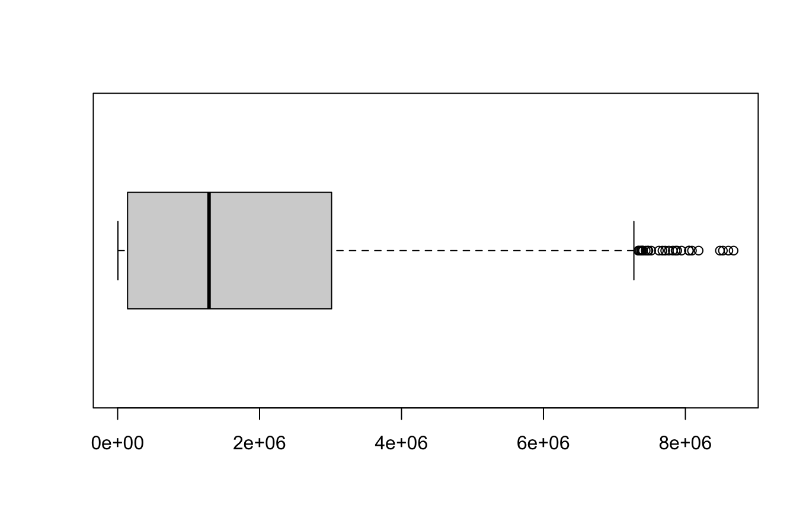

# R language for statistics
## Overview
Using R-language to process a MBTA dataset

## Download CSV
Download [csv](https://mbta-massdot.opendata.arcgis.com/datasets/a2d15ddd86b34867a31cd4b8e0a83932_0/explore).
## Read CSV
```r
data <- read.csv("file_name.csv")


```

## boxplot
The boxplot generated by this [code](TransitData.R) is  

This boxplot shows the distribution of ridership for MBTA routes.

